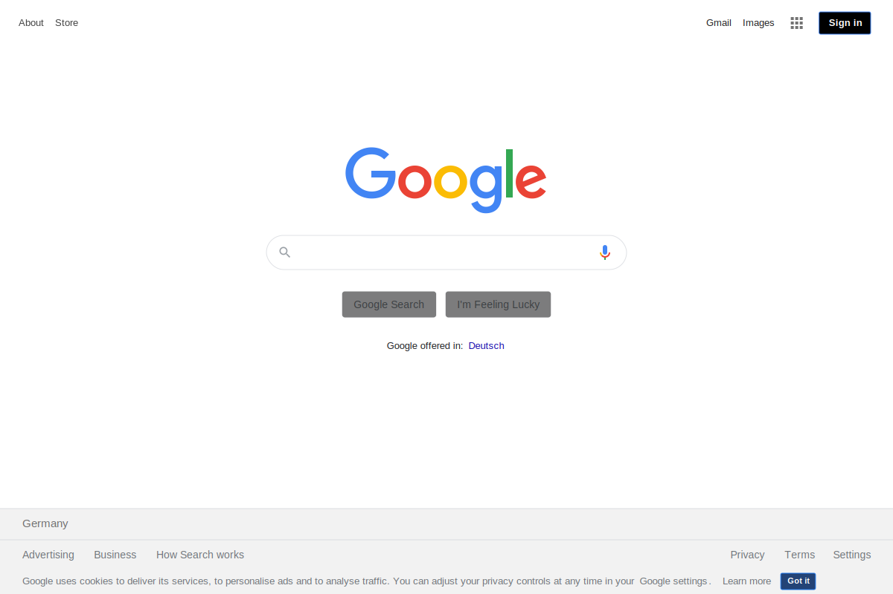

# SVG Screenshots Browser Extension

Browser extension to take semantic, scalable, accessible screenshots of websites, as SVG - as simple as taking a PNG screenshot.

## Why use this?

SVG screenshots offer various benefits over normal PNG screenshots, while keeping the good parts:

- **🖼 Flexible**: Freely select the region of the website you want to capture or capture the whole page.
- **💢 Scalable graphics**: Screenshots never get pixelated when zooming in.
- **📝 Semantic**: Text can still be selected and copied to clipboard.
- **🦻 Accessible**: SVG is annotated with ARIA attributes and can be read by screen readers.
- **🖥 Paste into design tools**: SVGs will work in design tools like Illustrator, Figma, Sketch etc.
- **🔗 Interactive**: Links are still clickable.
- **📦 Self-contained**: Inlines external resources like images, fonts, etc.
- **📸 Static**: Styles and layout are recorded at the time of snapshot and will not change.
- **🗜 Small**: Depending on the content, SVGs can be magnitudes smaller than PNGs and compress loslessly.
- **🛡 Secure**: The SVG will not run any JavaScript.

## Install

Install from the official extension stores:

- [Chrome](https://chrome.google.com/webstore/detail/svg-screenshot/nfakpcpmhhilkdpphcjgnokknpbpdllg)
- [Firefox](https://addons.mozilla.org/en-US/firefox/addon/svg-screenshots/)

## Examples

These full-page SVG screenshots were taken with the browser extension:

